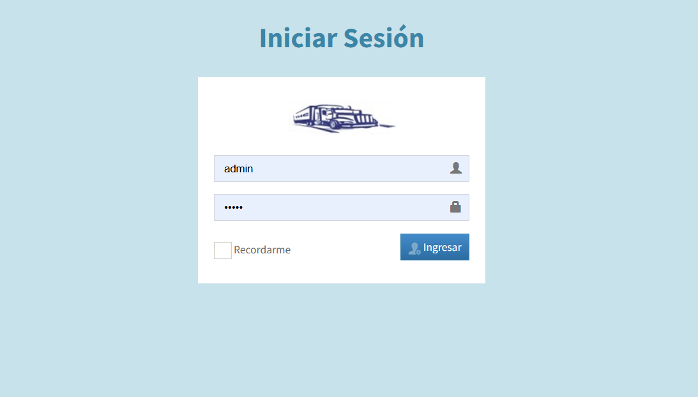
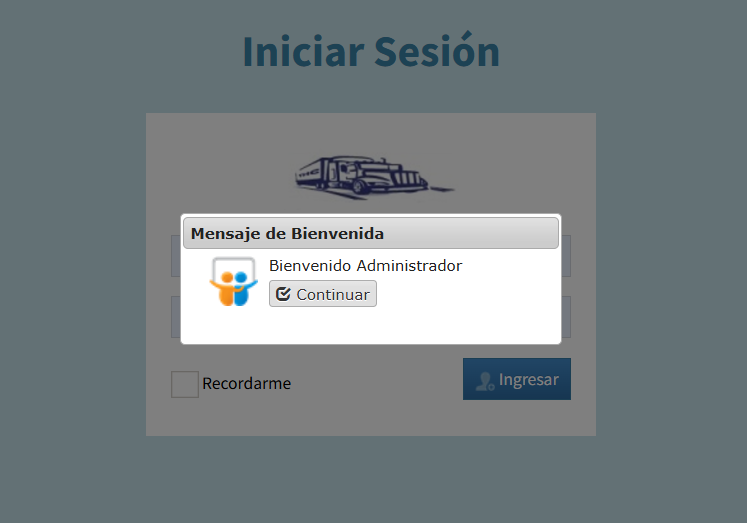
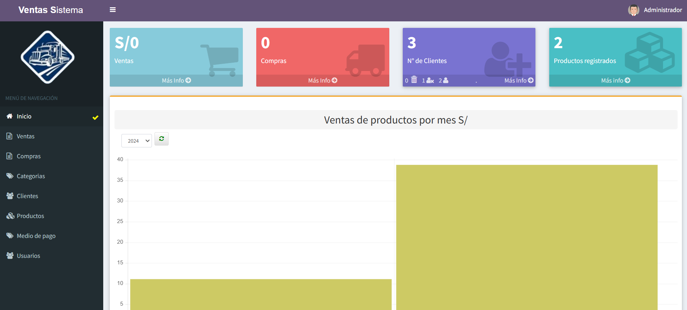
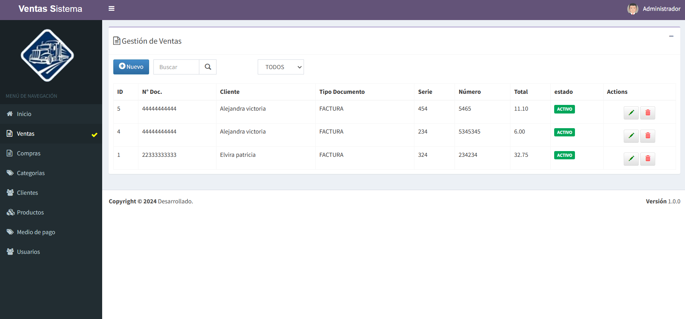
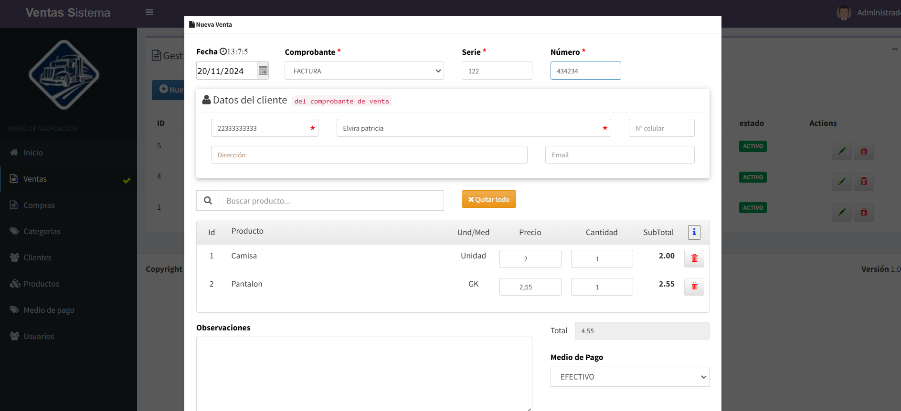
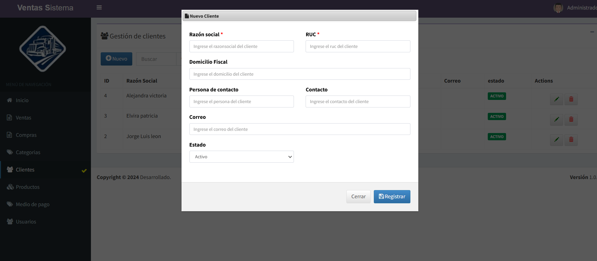
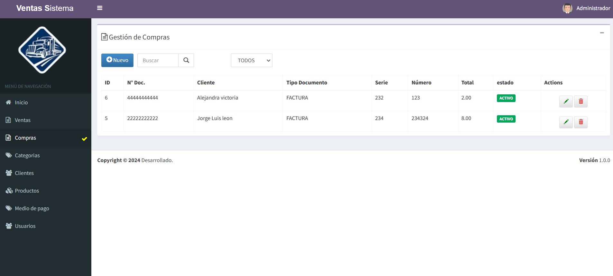

## Acerca del sistema

Es un sistema simple para administrar ventas y compras que cuenta con los siguientes módulos:

- Categorias.
- Clientes.
- Productos.
- Medios de pago.
- Usuarios.
- Compras.
- Ventas.

A continuación se muestran algunas imágenes de los módulos principales.

## Pagina de login

 
 

## Pagina principal

 

## Módulo de ventas

 
 

### Módulo de clientes

 

## Módulo de compras

 
 
Todos los Derechos reservados a @VentasOne
